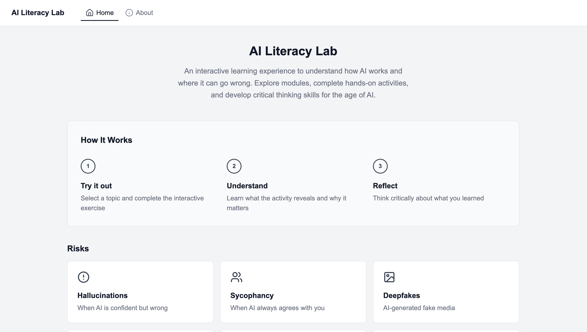

# AI Literacy Lab
An interactive educational website designed to help students and teachers understand how AI systems work and where they can go wrong.

The project emphasizes hands-on, experiential learning through activities that demonstrate real AI behaviors such as hallucinations, sycophancy, and bias. Users explore modules, complete activities, and build critical thinking skills for working with AI systems.

The AI Literacy Lab is designed as an evolving, dynamic platform. As AI technologies and research continue to change, new modules can be added and existing modules updated to reflect emerging risks, capabilities, and educational needs.

**Live site:** https://ailiteracylab.vercel.app/

## Preview


## Project Overview
The website is structured as a set of interactive modules, each focused on a specific concept or risk in AI. 

Each module includes:
- A guided interactive activity
- A short explanation of the concept
- Reflection prompts to reinforce learning

Tech Stack
- Next.js
- TypeScript
- React
- Tailwind CSS
- Lucide Icons
- Vercel (deployment)

## Getting Started

### 1. Clone the repo
```
git clone https://github.com/YOUR-USERNAME/ai-literacy-site.git
cd ai-literacy-site
```

### 2. Install dependences
`npm install`

### 3. Run the development server
`npm run dev`
Then open: http://localhost:3000

### 4. Development
Edit `page.tsx` files to modify the webpages. Folder paths correspond to URL routes. Changes auto-update during development.

## AI Assistance Statement
Portions of this project were developed with the assistance of AI tools, including OpenAI’s ChatGPT, Anthropic’s Claude, and GitHub Copilot. These tools supported implementation work in TypeScript and were also used to help refine ideas, structure and generate content for interactive activities, and troubleshoot issues during development.

All outputs were critically reviewed, tested, and revised by the authors, and all final design decisions, research, and implementations reflect our own work.

## Project Context
Developed as part of a group project for Duke University's Compsci 255: Introduction to Cyber Policy.

**Authors:** Angela Feng, Catie Barry, Celia Lawlor, Griffin Hayward, Mia Kaarls, and Tess Gray

MIT License